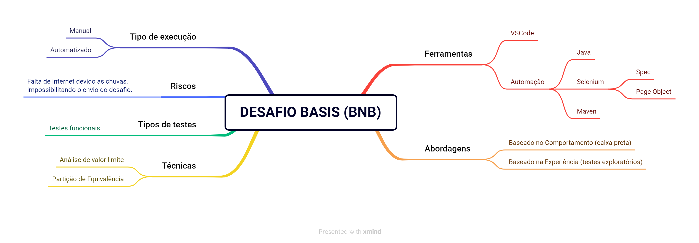
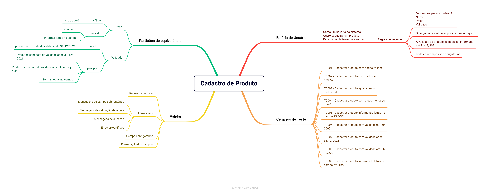
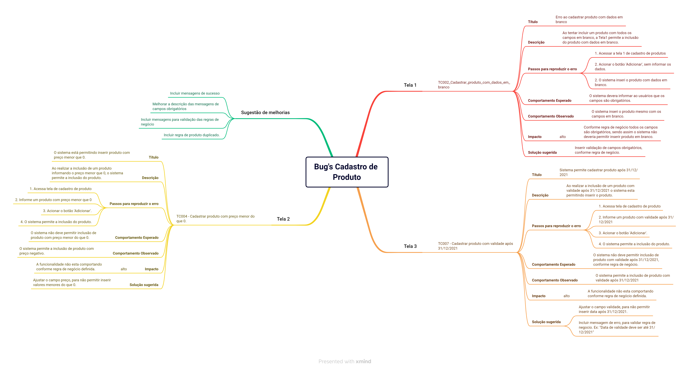

# Teste Prático BASIS

## 📋 Sobre

---

Este projeto foi desenvolvido para participar do processo seletivo na empresa BASIS, onde recebi um cenário contendo 3 telas, partindo de uma menos completa para mais completa, para responder 2 questões:
- Questão 1: Descrever um cenário de teste para aplicar nas telas e descrever o comportamento apresentado.
- Questão 2: Descreva quais ferramentas e técnicas usaria para automatizar o processo de testes para a funcionalidade acima descrita, e como isso poderia ser feito.

## Abordagem utilizada

---

Para a realização deste projeto foi utilizado as seguintes abordagens de testes:

- baseados em comportamento (caixa preta): a técnica utilizada para a cobertura dos cenários utilizados foram:
  - partição de equivalência
    - Valores válidos;
    - Valores inválidos;
- baseado na experiência
  - testes exploratórios

Os tipos de testes utilizados foram os testes funcionais, onde foi verificado o funcionamento da funcionalidade, conforme regras informadas para o teste prático.

---

## 📚 Planejamento dos testes

---

Segue descrito nos mapas mentais o planejamento para a realização dos testes.

### Planejamento

### Cenários de testes

---

## 🚀 Ferramentas utilizadas

---

- VSCode
- Selenium
- JUnit
- Maven
- Java

---

## ❌ Riscos

---

- Falta de internet devido as chuvas, impossibilitando o envio do desafio.

---

## 👾 Relatório de Bug's

---

### _Cadastro de Produtos_

# Observação

**Automatizei vários cenários de testes, e na descrição do comportamento em cada tela, selecionei três cenários importantes e que se comportaram de forma diferente em cada uma telas.**

###### 💼 Desenvolvido por Wesley Pereira de Jesus
